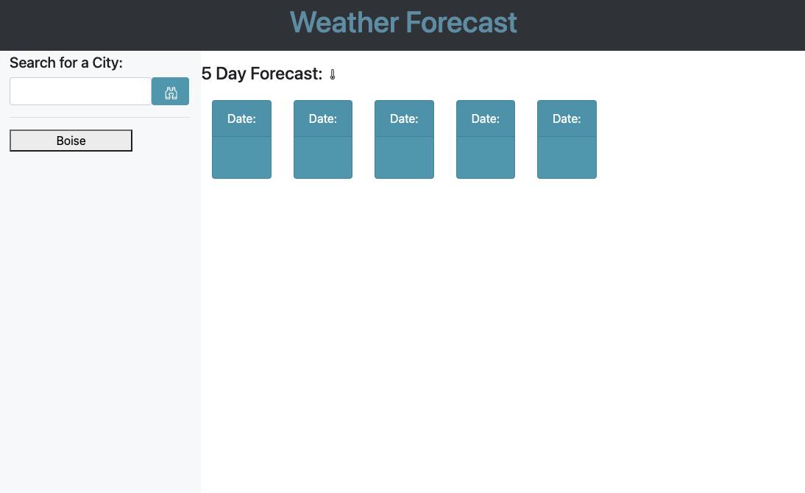

# hw6-WeatherDashboard

This weather Dashboard is designed to give you current, up-to-date weather whenever you need it for whichever city of your choosing!

## Viewable info includes:
* City Name
* Date
* Temperature
* Wind Speed
* Humidity

# Link to deployed app:
* Click [here]() to use!

## Built With
* HTML, CSS, Jquery, Bootstrap
* http://openweathermap.org/img/wn/10d@2x.png
* https://api.openweathermap.org/data/2.5/weather?q={city name}&appid={API key}
* https://api.openweathermap.org/data/2.5/forecast?q={city name}&appid={API key}

## Authors

* **Jesse Willig** - *Initial work* - [jessewillig](https://github.com/jessewillig)
* [jessewillig@outlook.com](mailto:jessewillig@outlook.com)